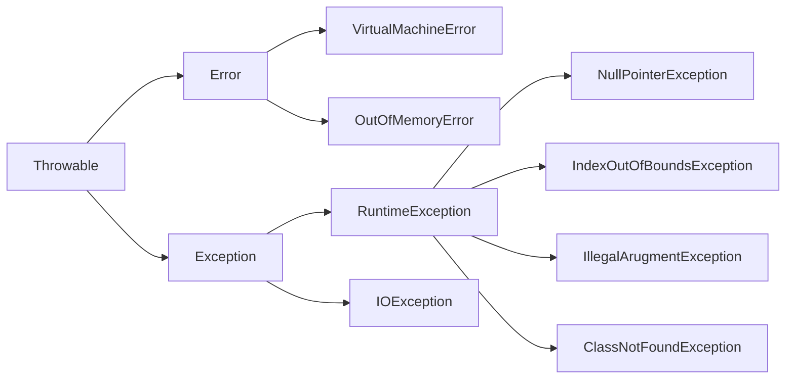

# 异常处理、IO、多线程、Maven 及常用的库

## 异常



### 定义

按照错误的严重性，从`Throwable`父类中衍生出`Error`和`Exception`

#### Error

程序在执行过程中所遇到的硬件或操作系统的错误。错误对程序而言是致命的，将导致程序无法运行。常见的错误有内存溢出，JVM 自身的非正常运行，class 文件没有主方法。程序本身无法处理 Error，而是交给系统来处理。

#### Exception

是程序正常运行中，可以预料的意外情况。比如数据库连接中断，空指针，数组下标越界。异常出现可以导致程序非正常终止，也可以预先检测，被捕获处理掉，使程序继续运行。同时异常按照性质，又分为编译异常（可检测）和运行时异常（不可检测）。

### 抛出异常

```java
throw new ExampleException();
```

```java
void exampleMethod() throws ExampleException {
  // ...
}
```

### 处理异常

```java
try {
  // code
} catch (ExampleException e) {
  // 捕获到异常Exception
} finally {
  // 最终执行
}
```

### 自定义异常

```java
class MyException extends RuntimeException {
  // ...
}
```

## IO

I/O 即输入 Input/ 输出 Output 的缩写，其实就是计算机调度把各个存储中（包括内存和外部存储）的数据写入写出的过程。java 中用“流（stream）”来抽象表示这么一个写入写出的功能，封装成一个“类”，都放在 java.io 这个包里面。流代表了数据的无结构化传递。

### 读取键盘输入

```java
Scanner scanner = new Scanner(System.in);

int i = scanner.nextInt();
```

### 文件 IO

```java
FileInputStream inputStream = new FileInputStream("file path");
FileOutputStream outputStream = new FileOutputStream("file path");
```

### 网络 IO

```java
URI uri = new URI("https://www.baidu.com");
InputStream inputStream = uri.toURL().openStream();
```

举例：下载文件到本地

```java
long start = System.currentTimeMillis();
InputStream stream = new URI("http://blog.dylan-deng.love/markdown.md").toURL().openStream();
File file = new File("file.md");

OutputStream out = new FileOutputStream(file);
out.write(stream.readAllBytes());

long end = System.currentTimeMillis();
System.out.println("花费时间: " + (end - start) + "ms");
stream.close();
out.close();
```

## New IO

Java NIO 用于提高输入输出操作的效率。它提供的缓冲区等工具可以让你构建出高效率、高性能的应用。

```java
long start = System.currentTimeMillis();
InputStream stream = new URI("http://blog.dylan-deng.love/markdown.md").toURL().openStream();
File file = new File("file.md");
Files.copy(stream, file.toPath(), StandardCopyOption.REPLACE_EXISTING);
long end = System.currentTimeMillis();
System.out.println("花费时间 " + (end - start) + "ms");
```

## 多线程

```java
// 下载大量文件
long start = System.currentTimeMillis();
for (int i = 1; i <= 10; i++) {
    InputStream stream = new URI("http://blog.dylan-deng.love/markdown.md").toURL().openStream();
    File file = new File("file" + i + ".md");
    Files.copy(stream, file.toPath(), StandardCopyOption.REPLACE_EXISTING);
}
long end = System.currentTimeMillis();
System.out.println("花费时间 " + (end - start) + "ms");
```

可以发现在有多个文件需要下载的时候，按顺序逐个下载会导致程序长时间卡顿。

### 进程（Process）

进程可以被定义为一个程序的执行实例。它是系统进行资源分配和调度的基本单位，是操作系统结构的基础。每个进程都拥有一个独立的内存地址空间，包括代码、数据和堆栈空间。进程之间的内存是隔离的，一个进程无法直接访问另一个进程的变量和数据结构，防止了数据的错乱和安全问题。

### 线程（Thread）

线程是进程中的一个实体，是被系统独立调度和分派的基本单位。一个进程可以由多个线程组成，它们共享进程的内存空间和资源，但每个线程拥有自己的执行堆栈和程序计数器。

### CPU 核心

CPU 核心是处理器中的一个物理单元，负责执行程序指令。一个 CPU 核心在任一时刻只能执行一个任务。

如何启动一个线程？

```java
new Thread(()->{
    // ...
}).start();
```

```java
long start = System.currentTimeMillis();
for (int i = 1; i <= 10; i++) {
		String fileName = "file" + i + ".md";
		new Thread(() -> {
				try {
						InputStream stream = new URI("http://blog.dylan-deng.love/markdown.md").toURL().openStream();
						File file = new File(fileName);
						Files.copy(stream, file.toPath(), StandardCopyOption.REPLACE_EXISTING);
				} catch (Exception e) {
						e.printStackTrace();
				}
		}).start();
}
long end = System.currentTimeMillis();
System.out.println("花费时间 " + (end - start) + "ms");
```



```mermaid
gantt
	dateFormat x
	axisFormat %H:%M:%S
    title 多线程

定义start变量: 1652187038860, 0.1s
线程1: 1652187038960, 1.1s
线程2: 1652187038970, 1.0s
线程3: 1652187038980, 1.2s
...: 1652187038990, 1.15s
计算总用时: 1652187039000, 0.1s
```

### 线程安全

```java
public class UnsafeCounter {
    private int count = 0;

    // 简单地增加计数器的值
    public void increment() {
        count++;
    }

    // 获取当前计数器的值
    public int getCount() {
        return count;
    }

    public static void main(String[] args) throws InterruptedException {
        UnsafeCounter unsafeCounter = new UnsafeCounter();

        // 创建并启动两个线程，都对同一个计数器进行操作
        Thread t1 = new Thread(() -> {
            for (int i = 0; i < 10000; i++) {
                unsafeCounter.increment();
            }
        });

        Thread t2 = new Thread(() -> {
            for (int i = 0; i < 10000; i++) {
                unsafeCounter.increment();
            }
        });

        t1.start();
        t2.start();

        // 等待两个线程都执行完毕
        t1.join();
        t2.join();

        // 输出最终的计数器值
        System.out.println("预期值: 20000");
        System.out.println("实际值: " + unsafeCounter.getCount());
    }
}
```

**问题**

考虑一个简单的整数加法操作，如 `count = count + 1`。尽管这看起来是一条简单的语句，但在多数处理器上，这个操作涉及下面几个步骤：

1. 从内存中读取 `count` 的当前值。
2. 在处理器中增加该值。
3. 将新值写回内存。

如果两个线程同时执行这个操作，那么可能出现以下情况：

- 线程 A 读取 `count` 的值为 1。
- 线程 B 也读取 `count` 的值为 1。
- 线程 A 增加值到 2，并写回内存。
- 线程 B 也增加值到 2，并写回内存。

在这种情况下，虽然 `count = count + 1` 被执行了两次，但 `count` 的值只从 1 变到 2

**正确的同步**

### 解决非原子操作引发的问题

为了避免非原子操作可能引起的问题而采取的策略：

- **锁定**：通过锁或其他同步机制确保在某一时刻只有一个线程可以执行某个操作。
- **原子操作**：使用可以在单个操作中完成的原子性指令（例如，硬件支持的原子指令集）。

为了避免这种情况，可以使用 Java 的同步关键字 `synchronized` 。使用 `synchronized` 后，`increment` 方法在任何时候最多只能由一个线程进入，这样就可以保证 `count++` 操作的线程安全性。

```java
public synchronized void increment() {
    count++;
}
```

另一种写法：修饰代码块

```java
public void increment() {
		synchronized (this){
				++count;
		}
}
```

在规范上：

- 建议使用**共享资源**作为锁对象
- 对于实例方法建议使用`this`作为锁对象
- 对于静态方法建议使用类对象作为锁对象`类名.class`

## Maven


Apache Maven，是一个项目管理及自动构建工具，由 Apache 软件基金会所提供。Maven 解决了软件构建的两方面问题：一是软件是如何构建的，二是软件的依赖关系。

Maven 项目使用项目对象模型（Project Object Model，POM）来配置。它的格式是 XML（Extensible Markup Language）

```xml
<?xml version="1.0" encoding="UTF-8"?>
<!--project是pom.xml根元素，它包含了pom.xml的一些约束信息-->
<!-- xmlns										命名空间，类似包名-->
<!-- xmlns:xsi								xml遵循的标签规范-->
<!--xsi:schemaLocation				定义xmlschema的地址，xml书写时需要遵循的语法-->
<project xmlns="http://maven.apache.org/POM/4.0.0"
         xmlns:xsi="http://www.w3.org/2001/XMLSchema-instance"
         xsi:schemaLocation="http://maven.apache.org/POM/4.0.0 http://maven.apache.org/xsd/maven-4.0.0.xsd">
		<!-- 指定了当前pom.xml版本，目前固定为4.0.0版本。-->
    <modelVersion>4.0.0</modelVersion>

    <!--  属于哪个组，一般是域名的倒序  -->
    <groupId>fun.sast</groupId>
		<!--  定义当前项目的唯一ID，一个groupId下面可能多个项目 -->
    <artifactId>maven-demo</artifactId>
  	<!--  定义项目当前的版本  -->
    <version>1.0-SNAPSHOT</version>

  	<!--  定义变量，在其他地方进行使用  -->
    <properties>
      	<!--java版本 -->
        <maven.compiler.source>21</maven.compiler.source>
        <maven.compiler.target>21</maven.compiler.target>
        <project.build.sourceEncoding>UTF-8</project.build.sourceEncoding>
    </properties>
		<!--定义的依赖清单，有所依赖包都需要写在这个标签里面-->
		<dependencies>
      ...
  	</dependencies>

  	<!--项目的构建配置-->
  	<build>
  	</build>
</project>
```

### 常用的库

**核心功能库**

1. **Apache Commons** - 提供了 Java 标准库未包含的一些基本实用工具类。

   - **Commons Lang** - 提供额外的数据类型操作，例如字符串处理、数值处理、并发包等。
   - **Commons IO** - 增强的文件和输入/输出流处理。
   - **Commons Collections** - 扩展了标准 Java Collections Framework 的功能。

2. **Google Guava** - 类似于 Apache Commons，它提供了大量的核心库功能，如集合处理、缓存、普通工具类和并发库。

**网络通信库**

1. **Netty** - 提供异步和事件驱动的网络应用程序框架和工具，用于快速开发高性能、高可靠性的网络服务器和客户端。
2. **OkHttp** - 是一个处理 HTTP 和 HTTP/2 请求的现代库，易于使用，并提供了同步和异步调用能力。

**数据库交互库**

1. **Hibernate** - 一个强大的对象关系映射 (ORM) 框架，它对 JDBC 进行了抽象，允许开发者通过 Java 对象而非复杂的 SQL 与数据库交互。
2. **MyBatis** - 一个半 ORM 和 SQL 映射框架，它提供了映射标记语言来配合 SQL 语句的执行。

**Web 开发框架**

1. **Spring Framework** - 提供了一个全面的编程和配置模型，为现代 Java 基础的企业应用提供了支持，包括 Spring MVC 用于 Web 应用。
2. **Vert.x** - 提供了用于构建响应式 Web 和企业级应用的异步编程模型，支持多种 JVM 语言，适合高性能和高并发的应用场景。

**测试库**

1. **JUnit** - 广泛使用的单元测试框架。

**JSON 处理库**

1. **Jackson** - 快速处理 JSON 的库，支持 JSON 到 Java 对象的序列化和反序列化。
2. **Gson** - Google 提供的用于序列化和反序列化 JSON 的库，易于使用。
