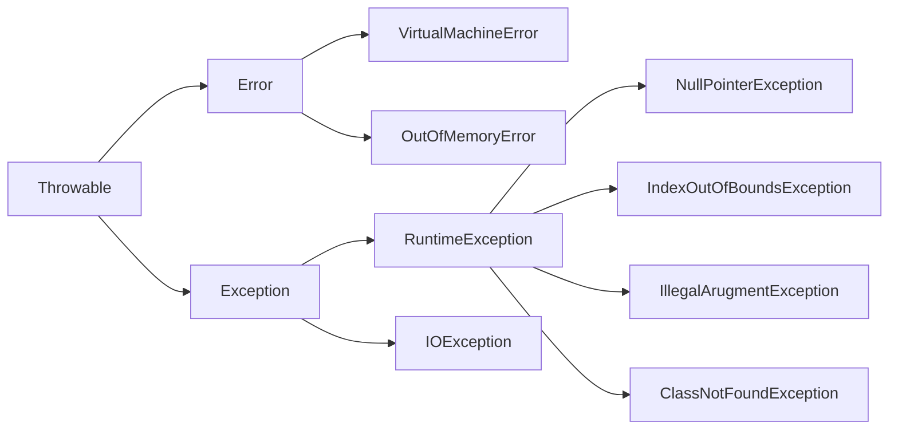

# 异常处理、IO、多线程与反射

## 异常



### 定义

按照错误的严重性，从`Throwable`父类中衍生出`Error`和`Exception`

#### Error

程序在执行过程中所遇到的硬件或操作系统的错误。错误对程序而言是致命的，将导致程序无法运行。常见的错误有内存溢出，JVM 自身的非正常运行，class 文件没有主方法。程序本身无法处理 Error，而是交给系统来处理。

#### Exception

是程序正常运行中，可以预料的意外情况。比如数据库连接中断，空指针，数组下标越界。异常出现可以导致程序非正常终止，也可以预先检测，被捕获处理掉，使程序继续运行。同时异常按照性质，又分为编译异常（可检测）和运行时异常（不可检测）。

### 抛出异常

```java
throw new ExampleException();
```

```java
void exampleMethod() throws ExampleException {
  // ...
}
```

### 处理异常

```java
try {
  // code
} catch (ExampleException e){
  // 捕获到异常Exception
} finally {
  // 最终执行
}
```

### 自定义异常

```java
class MyException extends RuntimeException {
  // ...
}
```

## IO

I/O 即输入 Input/ 输出 Output 的缩写，其实就是计算机调度把各个存储中（包括内存和外部存储）的数据写入写出的过程。java 中用“流（stream）”来抽象表示这么一个写入写出的功能，封装成一个“类”，都放在 java.io 这个包里面。流代表了数据的无结构化传递。

### 文件 IO

```java
FileInputStream inputStream = new FileInputStream("file path");
FileOutputStream outputStream = new FileOutputStream("file path");
```

### 网络 IO

```java
URI uri = new URI("https://www.baidu.com");
InputStream inputStream = uri.toURL().openStream();
```

举例：下载文件到本地

```java
long start = System.currentTimeMillis();
InputStream stream = new URI("http://blog.dylan-deng.love/markdown.md").toURL().openStream();
File file = new File("file.md");

OutputStream out = new FileOutputStream(file);
out.write(stream.readAllBytes());

long end = System.currentTimeMillis();
System.out.println("花费时间: " + (end - start) + "ms");
stream.close();
out.close();
```

## New IO

Java NIO 用于提高输入输出操作的效率。它提供的缓冲区等工具可以让你构建出高效率、高性能的应用。

```java
long start = System.currentTimeMillis();
InputStream stream = new URI("http://blog.dylan-deng.love/markdown.md").toURL().openStream();
File file = new File("file.md");
Files.copy(stream, file.toPath(), StandardCopyOption.REPLACE_EXISTING);
long end = System.currentTimeMillis();
System.out.println("花费时间 " + (end - start) + "ms");
```

## 多线程

```java
// 下载大量文件
long start = System.currentTimeMillis();
for (int i = 1; i <= 10; i++) {
    InputStream stream = new URI("http://blog.dylan-deng.love/markdown.md").toURL().openStream();
    File file = new File("file" + i + ".md");
    Files.copy(stream, file.toPath(), StandardCopyOption.REPLACE_EXISTING);
}
long end = System.currentTimeMillis();
System.out.println("花费时间 " + (end - start) + "ms");
```

可以发现在有多个文件需要下载的时候，按顺序逐个下载会导致程序长时间卡顿。

### 进程（Process）

进程可以被定义为一个程序的执行实例。它是系统进行资源分配和调度的基本单位，是操作系统结构的基础。每个进程都拥有一个独立的内存地址空间，包括代码、数据和堆栈空间。进程之间的内存是隔离的，一个进程无法直接访问另一个进程的变量和数据结构，防止了数据的错乱和安全问题。

### 线程（Thread）

线程是进程中的一个实体，是被系统独立调度和分派的基本单位。一个进程可以由多个线程组成，它们共享进程的内存空间和资源，但每个线程拥有自己的执行堆栈和程序计数器。

### CPU 核心

CPU 核心是处理器中的一个物理单元，负责执行程序指令。一个 CPU 核心在任一时刻只能执行一个任务。

如何启动一个线程？

```java
new Thread(()->{
    // ...
}).start();
```

```java
long start = System.currentTimeMillis();
for (int i = 1; i <= 10; i++) {
		String fileName = "file" + i + ".md";
		new Thread(() -> {
				try {
						InputStream stream = new URI("http://blog.dylan-deng.love/markdown.md").toURL().openStream();
						File file = new File(fileName);
						Files.copy(stream, file.toPath(), StandardCopyOption.REPLACE_EXISTING);
				} catch (Exception e) {
						e.printStackTrace();
				}
		}).start();
}
long end = System.currentTimeMillis();
System.out.println("花费时间 " + (end - start) + "ms");
```



```mermaid
gantt
	dateFormat x
	axisFormat %H:%M:%S
    title 多线程

定义start变量: 1652187038860, 0.1s
线程1: 1652187038960, 1.1s
线程2: 1652187038970, 1.0s
线程3: 1652187038980, 1.2s
...: 1652187038990, 1.15s
计算总用时: 1652187039000, 0.1s
```

### 线程安全

```java
public class UnsafeCounter {
    private int count = 0;

    // 简单地增加计数器的值
    public void increment() {
        count++;
    }

    // 获取当前计数器的值
    public int getCount() {
        return count;
    }

    public static void main(String[] args) throws InterruptedException {
        UnsafeCounter unsafeCounter = new UnsafeCounter();

        // 创建并启动两个线程，都对同一个计数器进行操作
        Thread t1 = new Thread(() -> {
            for (int i = 0; i < 10000; i++) {
                unsafeCounter.increment();
            }
        });

        Thread t2 = new Thread(() -> {
            for (int i = 0; i < 10000; i++) {
                unsafeCounter.increment();
            }
        });

        t1.start();
        t2.start();

        // 等待两个线程都执行完毕
        t1.join();
        t2.join();

        // 输出最终的计数器值
        System.out.println("预期值: 20000");
        System.out.println("实际值: " + unsafeCounter.getCount());
    }
}
```

**问题**

在多线程环境中，因为线程切换的时机是不确定的，两个线程可能同时读取相同的 `count` 值，然后各自增加 1，并将它写回，导致实际上丢失了一次增加操作。例如，如果两个线程同时读取 `count` 为 0，即使它们都执行了增加操作，`count` 最终值可能还是只增加了 1，成为 1 而不是 2。

**正确的同步**

为了避免这种情况，可以使用 Java 的同步关键字 `synchronized` 。使用 `synchronized` 后，`increment` 方法在任何时候最多只能由一个线程进入，这样就可以保证 `count++` 操作的线程安全性。

```java
public synchronized void increment() {
    count++;
}
```

另一种写法：修饰代码块

```java
public void increment() {
		synchronized (this){
				++count;
		}
}
```

在规范上：

- 建议使用**共享资源**作为锁对象
- 对于实例方法建议使用`this`作为锁对象
- 对于静态方法建议使用类对象作为锁对象`类名.class`

## 反射

在 Java 中，反射是一种强大的机制，它允许程序在运行时检查或修改其自身行为。使用反射，程序能够访问类的属性和方法，即使在编译时这些类的名称并未明确给出。这使得 Java 程序可以在运行时动态地创建对象、调用方法、改变字段等，即便这些类、方法或字段在编写原始代码时不可知。

```java
// 举例：输出一个类所有的字段和方法
public class Main {

    int field1;

    void method1() {
    }

    void method2() {
    }

    public static void main(String[] args) throws InterruptedException, Exception {
        Class<?> clazz = Main.class;
        for (Field field : clazz.getDeclaredFields()) {
            System.out.println("Field: " + field.getName());
        }
        for (Method method : clazz.getDeclaredMethods()) {
            System.out.println("Method: " + method.getName());
        }
    }
}
```

```java
// 举例：调用一个方法
Class<?> clazz = Main.class;
Constructor<?> constructor = clazz.getConstructor();
Object instance = constructor.newInstance();
clazz.getDeclaredMethod("method1").invoke(instance);
```

Class 类中用于获取构造方法的方法

| 方法名                                                         | 描述                           |
| -------------------------------------------------------------- | ------------------------------ |
| Constructor<?>[] getConstructors()                             | 返回所有公共构造方法对象的数组 |
| Constructor<?>[] getDeclaredConstructors()                     | 返回所有构造方法对象的数组     |
| Constructor getConstructor(Class<?>... parameterTypes)         | 返回单个公共构造方法对象       |
| Constructor getDeclaredConstructor(Class<?>... parameterTypes) | 返回单个构造方法对象           |

Constructor 类中用于创建对象的方法

| 方法名                            | 描述                         |
| --------------------------------- | ---------------------------- |
| T newInstance(Object... initargs) | 根据指定的构造方法创建对象   |
| void setAccessible(boolean flag)  | 设置为 true,表示取消访问检查 |

**反射获取成员变量**

| 方法名                                  | 描述                           |
| --------------------------------------- | ------------------------------ |
| Field[] getFields()                     | 返回所有公共成员变量对象的数组 |
| Field[] getDeclaredFields()             | 返回所有成员变量对象的数组     |
| Field getField(String name)             | 返回单个公共成员变量对象       |
| Field getDeclaredField(String name)     | 返回单个成员变量对象           |
| void set(Object instance, Object value) | 给指定对象的成员变量赋值       |
| Object get(Object instance)             | 返回成员变量的值               |

### 作用？

Spring 框架的实现

- Spring 框架的核心功能之一是依赖注入，它允许组件（beans）之间的依赖关系通过配置方式来管理，而不是通过组件内部硬编码。Spring 通过反射实现了这一机制。
- Spring AOP（面向切面编程）允许开发者定义方法拦截器和切点，来统一处理诸如事务管理、安全检查、日志记录等横切关注点。在运行时，使用反射调用方法前后，可以插入额外的操作。

### 缺点

- 性能开销：由于反射涉及动态解析的类型，因此无法执行某些 Java 虚拟机优化。 因此，反射操作的性能要比非反射操作的性能要差，应该在性能敏感的应用程序中频繁调用的代码段中避免。
- 破坏封装性：反射调用方法时可以忽略权限检查，因此可能会破坏封装性而导致安全问题。
- 内部曝光：由于反射允许代码执行在非反射代码中非法的操作，例如访问私有字段和方法，所以反射的使用可能会导致意想不到的副作用，这可能会导致代码功能失常并可能破坏可移植性。
